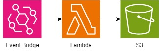

# 目的
マンションの販売情報を入手し、今後の物件探しに活用できるデータを取得すること。
    
# 構成図

# システム要件
以下の環境での動作を確認しました。
- **windows10**
- **Docker Desktop**
- **AWS CLI**
- **環境変数:**
  - AWS_ACCESS_KEY_ID AWSの公開鍵
  - AWS_SECRET_ACCESS_KEY AWSの秘密鍵
  - TF_VAR_bucket_name バケット名(任意)

# リポジトリの構成
- **Scrapy/**
  - scrapy startprojectで自動生成されたもの
- **Scrapy/Scrapy/scrapytest/scrapytest/spiders/my_scrapy.py**
  - spiderの処理定義およびハンドラ
- **Scrapy/Scrapy/scrapytest/scrapytest/spiders/my_scrapy.ipynb**
  - 上記動作確認用ノートブック
- **terraform/**
  - リソースごとのtfファイル
- **buckup_data/**
  - S3削除時にファイルを保存するフォルダ。中身はサンプルデータ
- **images/**
  - 構成図など
- **lambda_layer/**
  - AWS Lambda関数およびレイヤのためのDocker Imageを作成する
- **lambda_layer/build.bat**
  - AWS Lambda関数およびレイヤのための環境を作成する
- **lambda_layer/debug_atach.bat**
  - 上記デバッグ用
  

# 動作方法
deploy.bat、withdraw.batが存在するディレクトリに移動してください
- 開始:
  deploy.batを実行する。
- 終了:
  withdraw.batを実行する。

# 動作内容
7日ごとに中古マンションの販売情報から名称,価格,面積,住所,駅情報,レイアウト,築年月,URL,取得時刻を取得し、S3に格納する。

# スクレイピング対象の変更
Scrapy/Scrapy/scrapytest/scrapytest/spiders/my_scrapy.py
- 同フォルダのmy_scrapy.ipynbでデバックしながら上記ファイルのみ更新すればよい。
 